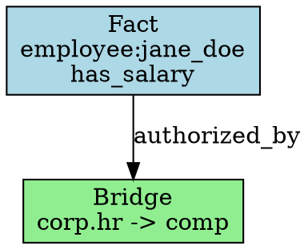
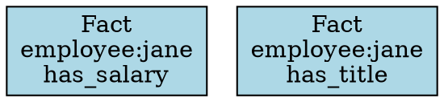
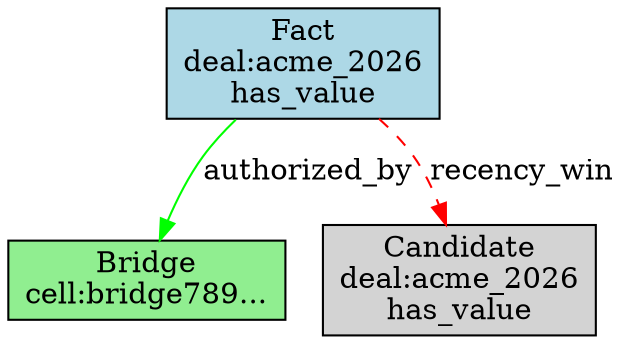

# Phase 6: Lineage Visualizer - Research

**Researched:** 2026-01-27
**Domain:** ProofBundle visualization (audit text and Graphviz DOT export)
**Confidence:** HIGH

## Summary

This research investigated how to implement lineage visualization for DecisionGraph ProofBundles. The goal is to add two methods to QueryResult/ProofBundle that produce deterministic, human-readable outputs: `to_audit_text()` for plain text audit reports and `to_dot()` for Graphviz DOT format lineage graphs.

The key architectural insight: **ProofBundle already contains all necessary data** (fact_cell_ids, candidate_cell_ids, bridges_used, resolution_events, authorization_basis). The visualization methods are pure transformations that read this data and format it - no additional chain traversal or Scholar queries needed.

**Primary recommendation:** Add two methods to QueryResult class in scholar.py: `to_audit_text()` returns deterministic multi-line string with decision summary, timestamps, authorization basis, facts, and resolution events. `to_dot()` returns valid Graphviz DOT syntax showing cell lineage with directed edges for dependencies. Both methods use sorted iteration for determinism.

---

## What Do I Need to Know to PLAN This Phase Well?

### 1. ProofBundle Structure (Already Exists)

**Current structure from Scholar (v1.3):**
```python
proof_bundle = {
    "query": {
        "namespace_scope": "corp.hr",
        "requester_id": "user:alice"
    },
    "results": {
        "fact_count": 1,
        "fact_cell_ids": ["cell:abc123..."]  # Sorted
    },
    "proof": {
        "candidates_considered": 2,
        "candidate_cell_ids": ["cell:abc...", "cell:def..."],  # Sorted
        "bridges_used": ["cell:bridge789..."],  # Sorted
        "resolution_events": [...]  # Sorted by conflict_key
    },
    "time_filters": {
        "at_valid_time": "2026-01-27T12:00:00Z",
        "as_of_system_time": "2026-01-27T12:00:00Z"
    },
    "authorization_basis": {
        "allowed": true,
        "reason": "bridge",
        "bridges_used": ["cell:bridge789..."],
        "bridge_effectiveness": [...]  # Sorted by bridge_cell_id
    },
    "scholar_version": "1.3"
}
```

**Key observation:** All lists are already sorted (see scholar.py:139-200). This means to_audit_text() and to_dot() can iterate directly without additional sorting, ensuring determinism.

---

### 2. Audit Text Format (VIS-01)

**Requirement:** `to_audit_text()` produces deterministic report

**What to include:**
1. **Header** - Query metadata (namespace, requester, timestamps)
2. **Authorization Summary** - Allowed/denied + reason
3. **Results** - Count and list of fact cell IDs
4. **Supporting Evidence** - Candidates considered, bridges used
5. **Resolution Details** - How conflicts were resolved
6. **Footer** - Scholar version, proof bundle version

**Example output format:**
```
DECISIONGRAPH AUDIT REPORT
==========================

Query Information:
  Namespace: corp.hr.compensation
  Requester: user:alice (corp.hr)
  Valid Time: 2026-01-27T12:00:00Z
  System Time: 2026-01-27T12:00:00Z

Authorization:
  Status: ALLOWED
  Reason: bridge
  Bridges Used:
    - cell:bridge789abc... (corp.hr -> corp.hr.compensation)

Results:
  Facts Returned: 2
  Fact Cells:
    - cell:abc123def... (employee:jane_doe has_salary $95000)
    - cell:def456ghi... (employee:jane_doe has_title "Senior Engineer")

Proof Details:
  Candidates Considered: 3
  Bridges Used: 1
  Conflicts Resolved: 1

Resolution Events:
  [1] Key: (corp.hr.compensation, employee:jane_doe, has_salary)
      Winner: cell:abc123def...
      Reason: recency_win
      Losers: cell:old567jkl...

Scholar Version: 1.3
Generated: 2026-01-27T12:00:00.123Z
```

**Design decisions:**
- Fixed-width formatting for readability
- Hierarchical structure with indentation
- Cell IDs truncated with ellipsis (first 12 chars) for readability
- Deterministic: same ProofBundle always produces identical text
- No markdown/HTML - plain text for universal compatibility

**Implementation approach:**
```python
def to_audit_text(self) -> str:
    """
    Generate human-readable audit report.

    Returns deterministic plain text report containing:
    - Query parameters (namespace, requester, timestamps)
    - Authorization basis (allowed/denied, reason, bridges)
    - Results summary (fact count, cell IDs)
    - Proof details (candidates, resolution events)
    - Scholar version

    Same QueryResult always produces identical output.
    """
    lines = []

    # Header
    lines.append("DECISIONGRAPH AUDIT REPORT")
    lines.append("=" * 50)
    lines.append("")

    # Query info
    lines.append("Query Information:")
    lines.append(f"  Namespace: {self.namespace_scope}")
    lines.append(f"  Requester: {self.requester_id} ({self.authorization.reason})")
    lines.append(f"  Valid Time: {self.valid_time}")
    lines.append(f"  System Time: {self.system_time}")
    lines.append("")

    # Authorization
    lines.append("Authorization:")
    status = "ALLOWED" if self.authorization.allowed else "DENIED"
    lines.append(f"  Status: {status}")
    lines.append(f"  Reason: {self.authorization.reason}")

    if self.authorization.bridges_used:
        lines.append("  Bridges Used:")
        for bridge_id in self.authorization.bridges_used:
            lines.append(f"    - {bridge_id}")

    if self.authorization.bridge_effectiveness:
        lines.append("  Bridge Effectiveness:")
        for be in self.authorization.bridge_effectiveness:
            status = "EFFECTIVE" if be.effective else "NOT EFFECTIVE"
            lines.append(f"    - {be.bridge_cell_id[:16]}... : {status} ({be.reason.value})")

    lines.append("")

    # Results
    lines.append("Results:")
    lines.append(f"  Facts Returned: {len(self.facts)}")
    if self.facts:
        lines.append("  Fact Cells:")
        for fact in self.facts:
            # Include fact summary
            lines.append(f"    - {fact.cell_id[:16]}... ({fact.fact.subject} {fact.fact.predicate} {fact.fact.object[:20]}...)")
    lines.append("")

    # Proof details
    lines.append("Proof Details:")
    lines.append(f"  Candidates Considered: {len(self.candidates)}")
    lines.append(f"  Bridges Used: {len(self.bridges_used)}")
    lines.append(f"  Conflicts Resolved: {len([e for e in self.resolution_events if e.reason != ResolutionReason.SINGLE_CANDIDATE])}")
    lines.append("")

    # Resolution events
    if self.resolution_events:
        lines.append("Resolution Events:")
        for i, event in enumerate(self.resolution_events, 1):
            lines.append(f"  [{i}] Key: {event.conflict_key}")
            lines.append(f"      Winner: {event.winner_cell_id[:16]}...")
            lines.append(f"      Reason: {event.reason.value}")
            if event.loser_cell_ids:
                lines.append(f"      Losers: {', '.join([lid[:16] + '...' for lid in event.loser_cell_ids])}")
        lines.append("")

    # Footer
    lines.append("Scholar Version: 1.3")
    lines.append(f"Generated: {self.system_time}")

    return "\n".join(lines)
```

**Determinism guarantee:** All iterations use sorted lists from ProofBundle. No timestamps added (use existing system_time). No randomness.

---

### 3. Graphviz DOT Format (VIS-02)

**Requirement:** `to_dot()` produces valid Graphviz DOT output

**What is DOT format?**
DOT is a plain text graph description language used by Graphviz. It describes nodes and edges.

**Basic DOT syntax:**


**What to visualize:**
1. **Fact cells** - Blue boxes showing subject/predicate
2. **Bridge cells** - Green boxes showing namespace bridge
3. **Candidate cells** (not winners) - Gray boxes (for audit)
4. **Edges** - Dependencies:
   - Fact → Bridge (authorized_by)
   - Winner → Losers (conflict_resolution)
   - Cell → prev_cell (chain linkage, optional)

**Design decisions:**
- Use `digraph` (directed graph)
- Node shapes: box for cells
- Node colors: lightblue (facts), lightgreen (bridges), lightgray (candidates)
- Edge labels: relationship type
- rankdir=TB (top to bottom layout)
- Truncate cell IDs to first 12 chars for readability
- Include fact content in node labels

**Implementation approach:**
```python
def to_dot(self) -> str:
    """
    Generate Graphviz DOT format for lineage visualization.

    Returns valid DOT syntax showing:
    - Fact cells (blue boxes)
    - Bridge cells (green boxes)
    - Candidate cells (gray boxes)
    - Authorization edges (fact -> bridge)
    - Resolution edges (winner -> loser)

    Output can be rendered with: dot -Tpng lineage.dot -o lineage.png

    Same QueryResult always produces identical output (deterministic).
    """
    lines = []

    # Graph header
    lines.append("digraph decision_lineage {")
    lines.append("  // DecisionGraph Lineage Visualization")
    lines.append("  rankdir=TB;")
    lines.append("  node [shape=box, style=filled];")
    lines.append("")

    # Helper to escape DOT strings
    def escape(s: str) -> str:
        return s.replace('"', '\\"').replace('\\n', '\\\\n')

    # Helper to truncate cell ID
    def short_id(cell_id: str) -> str:
        return cell_id[:12] + "..."

    # Fact cells (winners)
    lines.append("  // Winning Facts")
    for fact in self.facts:
        label = f"Fact\\n{fact.fact.subject}\\n{fact.fact.predicate}"
        lines.append(f'  "{short_id(fact.cell_id)}" [label="{escape(label)}", fillcolor=lightblue];')
    lines.append("")

    # Bridge cells
    lines.append("  // Bridges")
    bridge_cells = {}
    if self.authorization.bridges_used:
        # Need to fetch bridge cell details from index
        # Actually, we don't have access to full cells here, only IDs
        # We'll just show bridge IDs
        for bridge_id in sorted(self.authorization.bridges_used):
            label = f"Bridge\\n{short_id(bridge_id)}"
            lines.append(f'  "{short_id(bridge_id)}" [label="{escape(label)}", fillcolor=lightgreen];')
    lines.append("")

    # Candidate cells (non-winners)
    lines.append("  // Candidates (non-winners)")
    winner_ids = {f.cell_id for f in self.facts}
    for candidate in self.candidates:
        if candidate.cell_id not in winner_ids:
            label = f"Candidate\\n{candidate.fact.subject}\\n{candidate.fact.predicate}"
            lines.append(f'  "{short_id(candidate.cell_id)}" [label="{escape(label)}", fillcolor=lightgray];')
    lines.append("")

    # Authorization edges (fact -> bridge)
    if self.authorization.allowed and self.authorization.bridges_used:
        lines.append("  // Authorization edges")
        for fact in self.facts:
            for bridge_id in sorted(self.authorization.bridges_used):
                lines.append(f'  "{short_id(fact.cell_id)}" -> "{short_id(bridge_id)}" [label="authorized_by", color=green];')
        lines.append("")

    # Resolution edges (winner -> losers)
    lines.append("  // Resolution edges")
    for event in self.resolution_events:
        if event.loser_cell_ids:  # Only if there were conflicts
            for loser_id in event.loser_cell_ids:
                lines.append(f'  "{short_id(event.winner_cell_id)}" -> "{short_id(loser_id)}" [label="{event.reason.value}", color=red, style=dashed];')
    lines.append("")

    # Graph footer
    lines.append("}")

    return "\n".join(lines)
```

**Determinism guarantee:**
- All iterations use sorted lists (fact_cell_ids, bridges_used, etc.)
- Node declarations follow consistent order (facts, bridges, candidates)
- Edge declarations follow consistent order (authorization, resolution)
- String escaping is deterministic

**Validation:** The output can be validated by:
```bash
echo '<dot_output>' | dot -Tsvg -o /dev/null  # Should exit 0 if valid
```

---

### 4. Where to Add Methods

**Option A: Add to QueryResult class (RECOMMENDED)**
```python
# In scholar.py, QueryResult class
@dataclass
class QueryResult:
    # ... existing fields ...

    def to_proof_bundle(self) -> Dict:
        """Existing method - generates canonical proof bundle"""
        pass

    def to_audit_text(self) -> str:
        """NEW: Generate human-readable audit report"""
        pass

    def to_dot(self) -> str:
        """NEW: Generate Graphviz DOT format"""
        pass
```

**Why QueryResult?**
- QueryResult has access to full cell objects (facts, candidates)
- Can include rich details (fact.subject, fact.predicate, etc.)
- Already has to_proof_bundle() method
- Natural place for visualization methods

**Option B: Add to ProofBundle dict**
Not feasible - ProofBundle is a dict, not a class. Would need to create ProofBundle class first.

**Option C: Standalone functions**
```python
def proof_bundle_to_audit_text(bundle: dict) -> str:
    pass

def proof_bundle_to_dot(bundle: dict) -> str:
    pass
```

Less ergonomic, but could work if we want to visualize externally-received ProofBundles (not from local Scholar).

**Recommendation:** **Option A** - Add methods to QueryResult. Simplest, most ergonomic, aligns with existing to_proof_bundle() pattern.

---

### 5. Cell Access for Rich Visualization

**Challenge:** DOT visualization benefits from cell details (subject, predicate, object).

**Current state:**
- QueryResult has `facts: List[DecisionCell]` - full cell objects
- QueryResult has `candidates: List[DecisionCell]` - full cell objects
- QueryResult has `bridges_used: List[str]` - just IDs

**For bridges:**
We can use ScholarIndex or NamespaceRegistry to look up bridge cells if needed. But for Phase 6, **just showing bridge cell IDs is sufficient**. Rich bridge visualization can be Phase 7+.

**Simpler approach:**
```python
# In to_dot(), for bridges:
for bridge_id in sorted(self.authorization.bridges_used):
    label = f"Bridge\\n{bridge_id[:12]}..."
    lines.append(f'  "{bridge_id[:12]}..." [label="{label}", fillcolor=lightgreen];')
```

This avoids needing ScholarIndex access within QueryResult methods.

---

### 6. Determinism Requirements

**From success criteria:**
> "Same ProofBundle always produces identical audit text (deterministic)"

**What ensures determinism:**

1. **Sorted iteration:**
   - facts are already sorted (scholar.py:801)
   - candidates are already sorted (scholar.py:804)
   - bridges_used are already sorted (scholar.py:807)
   - resolution_events are already sorted (scholar.py:810)
   - bridge_effectiveness is already sorted (scholar.py:159-171)

2. **No timestamps:**
   - Don't add current_timestamp() in visualization
   - Use existing system_time from query

3. **No randomness:**
   - No uuid generation
   - No random sampling or shuffling

4. **Consistent formatting:**
   - Fixed string templates
   - Deterministic truncation (first N chars)
   - Deterministic escaping

5. **No external state:**
   - Don't fetch additional data from chain
   - Work only with QueryResult fields

**Verification test:**
```python
def test_to_audit_text_deterministic():
    """Same QueryResult produces identical audit text."""
    result1 = scholar.query_facts(...)
    result2 = scholar.query_facts(...)  # Same query

    text1 = result1.to_audit_text()
    text2 = result2.to_audit_text()

    assert text1 == text2

def test_to_dot_deterministic():
    """Same QueryResult produces identical DOT output."""
    result1 = scholar.query_facts(...)
    result2 = scholar.query_facts(...)

    dot1 = result1.to_dot()
    dot2 = result2.to_dot()

    assert dot1 == dot2
```

---

### 7. Graphviz Dependency

**Question:** Do we require users to install Graphviz?

**Answer:** **No.** We produce DOT text format, which is human-readable and standard. Users can:
1. Copy/paste to online Graphviz visualizers (like viz-js.com)
2. Install Graphviz locally and run `dot -Tpng`
3. Use online tools like Graphviz Online
4. Store DOT text in version control (readable text format)

**No Python graphviz library needed.** We're generating text, not rendering images.

**Documentation note:** Include usage examples:
```python
# Generate DOT
result = scholar.query_facts(...)
dot_text = result.to_dot()

# Save to file
with open('lineage.dot', 'w') as f:
    f.write(dot_text)

# Render (if Graphviz installed):
# $ dot -Tpng lineage.dot -o lineage.png
# $ dot -Tsvg lineage.dot -o lineage.svg
```

---

### 8. Error Handling

**What can go wrong?**

For `to_audit_text()`:
- Nothing - it only formats existing data
- No I/O, no network calls, no external dependencies
- Worst case: encoding error if cell data has weird unicode (already validated by input validators)

For `to_dot()`:
- Invalid DOT syntax if escaping fails
- But we control all inputs (cell IDs, predicates are validated)

**Error handling strategy:**
```python
def to_audit_text(self) -> str:
    """Generate audit text. Never raises exceptions."""
    try:
        # ... formatting logic ...
        return "\n".join(lines)
    except Exception as e:
        # Fallback: minimal report
        return f"AUDIT REPORT (error: {str(e)})\n" + \
               f"Facts: {len(self.facts)}\n" + \
               f"Authorization: {self.authorization.allowed}"

def to_dot(self) -> str:
    """Generate DOT. Never raises exceptions."""
    try:
        # ... DOT generation ...
        return "\n".join(lines)
    except Exception as e:
        # Fallback: minimal graph
        return f"digraph error {{ label=\"Error: {str(e)}\"; }}"
```

**Rationale:** Visualization failures shouldn't break the system. Return degraded output rather than raising exceptions.

---

### 9. Testing Strategy

**What to test:**

#### Audit Text Tests (VIS-01)
```python
def test_to_audit_text_contains_query_info():
    """Audit text includes namespace, requester, timestamps."""
    pass

def test_to_audit_text_contains_authorization():
    """Audit text includes authorization status and reason."""
    pass

def test_to_audit_text_contains_results():
    """Audit text includes fact count and cell IDs."""
    pass

def test_to_audit_text_deterministic():
    """Same query produces identical audit text."""
    pass

def test_to_audit_text_with_bridges():
    """Audit text includes bridge information."""
    pass

def test_to_audit_text_with_conflicts():
    """Audit text includes resolution events."""
    pass

def test_to_audit_text_access_denied():
    """Audit text shows DENIED status when not authorized."""
    pass
```

#### DOT Tests (VIS-02)
```python
def test_to_dot_valid_syntax():
    """DOT output is parseable by Graphviz (basic validation)."""
    dot = result.to_dot()
    assert dot.startswith("digraph")
    assert dot.endswith("}")
    assert "node [" in dot

def test_to_dot_contains_fact_nodes():
    """DOT includes nodes for fact cells."""
    pass

def test_to_dot_contains_bridge_nodes():
    """DOT includes nodes for bridge cells."""
    pass

def test_to_dot_contains_authorization_edges():
    """DOT includes edges from facts to bridges."""
    pass

def test_to_dot_contains_resolution_edges():
    """DOT includes edges from winners to losers."""
    pass

def test_to_dot_deterministic():
    """Same query produces identical DOT output."""
    pass

def test_to_dot_escapes_special_chars():
    """DOT properly escapes quotes and backslashes."""
    pass
```

#### Integration Tests
```python
def test_process_rfa_to_audit_text_end_to_end():
    """Full pipeline: RFA -> ProofPacket -> audit text."""
    packet = engine.process_rfa(rfa)
    # Need to recreate QueryResult from ProofBundle to call to_audit_text()
    # OR: add to_audit_text() to ProofBundle dict processing
    pass

def test_export_formats_match_proof_bundle():
    """Audit text and DOT reflect same proof_bundle data."""
    pass
```

**Total new tests:** ~15-20 tests

---

### 10. Files to Create/Modify

**Modified files:**
1. `src/decisiongraph/scholar.py`
   - Add `to_audit_text()` method to QueryResult class
   - Add `to_dot()` method to QueryResult class
   - Export new methods in `__all__`

2. `tests/test_scholar.py` (or new test_lineage_visualizer.py)
   - Add tests for to_audit_text() - ~8 tests
   - Add tests for to_dot() - ~8 tests
   - Add determinism tests

3. `src/decisiongraph/__init__.py`
   - No changes needed (methods are on QueryResult, already exported)

**New files:**
- `tests/test_lineage_visualizer.py` (optional, could use existing test_scholar.py)

**Total:** 2 modified files, 0-1 new files

---

### 11. Dependencies on Previous Phases

**Phase 4 (RFA Processing Layer):**
- ✓ ProofBundle structure exists
- ✓ QueryResult.to_proof_bundle() provides canonical format
- **Used by:** Validation that audit text reflects proof_bundle

**Existing v1.3:**
- ✓ QueryResult class with facts, candidates, bridges_used
- ✓ ResolutionReason enum
- ✓ BridgeEffectivenessReason enum
- ✓ AuthorizationBasis dataclass
- **Used by:** All visualization logic

**No new dependencies needed.** Pure Python, no external libraries.

---

### 12. Edge Cases to Handle

**Case 1: No facts returned (access denied)**
```python
# Audit text should show:
# Results: Facts Returned: 0
# Authorization: Status: DENIED
```

**Case 2: No conflicts (single candidate)**
```python
# Resolution events still listed, but with reason=SINGLE_CANDIDATE
# Losers list is empty
```

**Case 3: No bridges (same namespace)**
```python
# Authorization section shows:
# Bridges Used: (none)
# Reason: same_namespace
```

**Case 4: Empty query (namespace-wide search)**
```python
# Valid - just shows all facts in namespace
# DOT graph could be large
```

**Case 5: Unicode in cell data**
```python
# Already validated by input validators
# Should handle correctly in DOT escaping
```

**Case 6: Very long cell IDs**
```python
# Truncate with ellipsis for readability
# Use first 12-16 chars
```

---

### 13. Performance Considerations

**Bottlenecks:**
1. **String concatenation:** Building large reports with many cells
2. **Iteration:** Looping over candidates, resolution events
3. **String escaping:** For DOT format

**Optimizations:**
- Use list.append() + "\n".join() instead of += for string building
- Pre-allocate list with estimated size (optional)
- Limit output size for very large result sets (optional)

**For Phase 6:**
- No optimizations needed
- Typical queries return <100 facts
- String building is fast enough

**Future optimizations (v2+):**
- Add max_nodes parameter to to_dot() to limit graph size
- Add pagination to to_audit_text()
- Stream output for very large results

---

### 14. DOT Layout Options

**Current recommendation:** Use simple `rankdir=TB` (top to bottom).

**Alternative layouts:**
```dot
rankdir=LR;  // Left to right (good for wide graphs)
rankdir=BT;  // Bottom to top (reverse)
rankdir=RL;  // Right to left (reverse)
```

**Node clustering:**
```dot
subgraph cluster_facts {
    label="Facts";
    // fact nodes
}
subgraph cluster_bridges {
    label="Bridges";
    // bridge nodes
}
```

**For Phase 6:** Keep it simple - TB layout, no clustering. Advanced layouts in v2.

---

### 15. Example Outputs

**Example 1: Simple query (same namespace)**

Audit Text:
```
DECISIONGRAPH AUDIT REPORT
==================================================

Query Information:
  Namespace: corp.hr
  Requester: user:alice (corp.hr)
  Valid Time: 2026-01-27T12:00:00Z
  System Time: 2026-01-27T12:00:00Z

Authorization:
  Status: ALLOWED
  Reason: same_namespace

Results:
  Facts Returned: 2
  Fact Cells:
    - cell:abc123de... (employee:jane has_salary $95000)
    - cell:def456gh... (employee:jane has_title "Engineer")

Proof Details:
  Candidates Considered: 2
  Bridges Used: 0
  Conflicts Resolved: 0

Resolution Events:
  [1] Key: (corp.hr, employee:jane, has_salary)
      Winner: cell:abc123de...
      Reason: single

  [2] Key: (corp.hr, employee:jane, has_title)
      Winner: cell:def456gh...
      Reason: single

Scholar Version: 1.3
Generated: 2026-01-27T12:00:00Z
```

DOT:


**Example 2: Bridge query with conflict**

Audit Text:
```
DECISIONGRAPH AUDIT REPORT
==================================================

Query Information:
  Namespace: corp.sales
  Requester: user:auditor (corp.audit)
  Valid Time: 2026-01-27T15:00:00Z
  System Time: 2026-01-27T15:00:00Z

Authorization:
  Status: ALLOWED
  Reason: bridge
  Bridges Used:
    - cell:bridge789...
  Bridge Effectiveness:
    - cell:bridge789... : EFFECTIVE (authorized)

Results:
  Facts Returned: 1
  Fact Cells:
    - cell:newcell12... (deal:acme_2026 has_value $500000)

Proof Details:
  Candidates Considered: 2
  Bridges Used: 1
  Conflicts Resolved: 1

Resolution Events:
  [1] Key: (corp.sales, deal:acme_2026, has_value)
      Winner: cell:newcell12...
      Reason: recency_win
      Losers: cell:oldcell34...

Scholar Version: 1.3
Generated: 2026-01-27T15:00:00Z
```

DOT:


---

### 16. Open Questions & Decisions

#### Q1: Should we include cell prev_cell_hash in DOT graph?
**Options:**
A. Yes - show full chain linkage
B. No - focus on decision lineage only

**Recommendation:** **No** for Phase 6. prev_cell_hash creates very dense graphs. Focus on decision lineage (facts → bridges, winners → losers). Full chain visualization can be v2 feature.

#### Q2: Should audit text include cell timestamps?
**Options:**
A. Yes - show when each cell was created
B. No - use query timestamps only

**Recommendation:** **No** for Phase 6. Query timestamps (at_valid_time, as_of_system_time) are sufficient. Individual cell timestamps would make output non-deterministic if cells are fetched dynamically. Keep it simple.

#### Q3: Should DOT nodes show confidence scores?
**Options:**
A. Yes - add confidence to node labels
B. No - keep labels simple

**Recommendation:** **Optional for v2.** For Phase 6, keep labels simple (subject + predicate). Rich node details can be added later.

#### Q4: What if ProofBundle has 1000+ facts?
**Options:**
A. Limit output (top N facts)
B. Paginate
C. No limit (render all)

**Recommendation:** **No limit for Phase 6.** If this becomes a problem in production, add max_facts parameter in v2.

#### Q5: Should to_audit_text() accept format parameter?
**Options:**
A. Yes - support JSON, YAML, etc.
B. No - fixed text format

**Recommendation:** **No** for Phase 6. Fixed text format keeps it simple. JSON export already exists (to_proof_bundle()). YAML can be v2 feature.

---

## Implementation Recommendations

### Method Signatures

```python
# In scholar.py, QueryResult class

def to_audit_text(self) -> str:
    """
    Generate human-readable audit report.

    Returns deterministic plain text report containing:
    - Query parameters (namespace, requester, timestamps)
    - Authorization basis (allowed/denied, reason, bridges)
    - Results summary (fact count, cell IDs)
    - Proof details (candidates, resolution events)
    - Scholar version

    Same QueryResult always produces identical output (deterministic).

    Returns:
        Multi-line string with audit report

    Example:
        result = scholar.query_facts(...)
        report = result.to_audit_text()
        print(report)
        # Or save to file:
        with open('audit.txt', 'w') as f:
            f.write(report)
    """
    pass

def to_dot(self) -> str:
    """
    Generate Graphviz DOT format for lineage visualization.

    Returns valid DOT syntax showing:
    - Fact cells (blue boxes)
    - Bridge cells (green boxes)
    - Candidate cells (gray boxes)
    - Authorization edges (fact -> bridge)
    - Resolution edges (winner -> loser)

    Output can be rendered with Graphviz:
        $ dot -Tpng lineage.dot -o lineage.png
        $ dot -Tsvg lineage.dot -o lineage.svg

    Or online tools: viz-js.com, Graphviz Online

    Same QueryResult always produces identical output (deterministic).

    Returns:
        String containing valid DOT syntax

    Example:
        result = scholar.query_facts(...)
        dot_text = result.to_dot()
        with open('lineage.dot', 'w') as f:
            f.write(dot_text)
        # Then: dot -Tpng lineage.dot -o lineage.png
    """
    pass
```

### Testing Approach

**Test file:** `tests/test_lineage_visualizer.py` (new file)

```python
"""
Tests for Phase 6: Lineage Visualizer

Tests VIS-01 (to_audit_text) and VIS-02 (to_dot) requirements.
"""

import pytest
from decisiongraph import Scholar, create_scholar
from test_utils import create_test_chain_with_facts

class TestAuditText:
    """Tests for QueryResult.to_audit_text() - VIS-01"""

    def test_to_audit_text_contains_query_info(self):
        """Audit text includes namespace, requester, timestamps."""
        pass

    def test_to_audit_text_deterministic(self):
        """Same QueryResult produces identical audit text."""
        pass

    # ... more tests

class TestDOT:
    """Tests for QueryResult.to_dot() - VIS-02"""

    def test_to_dot_valid_syntax(self):
        """DOT output has valid structure (digraph ... })."""
        pass

    def test_to_dot_deterministic(self):
        """Same QueryResult produces identical DOT."""
        pass

    # ... more tests

class TestLineageVisualizerIntegration:
    """End-to-end tests with bridges and conflicts."""

    def test_audit_text_with_bridge_and_conflict(self):
        """Full scenario: bridge auth + conflict resolution."""
        pass
```

---

## Risk Analysis

### HIGH RISK: String escaping in DOT
**Risk:** Invalid DOT if we don't escape quotes/backslashes correctly.
**Mitigation:**
- Comprehensive escape function: `s.replace('"', '\\"').replace('\\n', '\\\\n')`
- Test with cell data containing quotes, backslashes, newlines
- Add test: "to_dot with special characters"

### MEDIUM RISK: Output size for large results
**Risk:** Audit text or DOT could be megabytes for 1000+ facts.
**Impact:** Memory usage, rendering time
**Mitigation:**
- For Phase 6: No mitigation (accept large outputs)
- For v2: Add max_facts parameter or streaming

### LOW RISK: Non-determinism from iteration order
**Risk:** If lists aren't sorted, output varies.
**Mitigation:**
- All lists in ProofBundle are already sorted (verified in scholar.py)
- Add determinism tests to verify

### LOW RISK: Unicode handling
**Risk:** Encoding errors with non-ASCII cell data.
**Mitigation:**
- Python 3 handles unicode natively
- Input validators already reject control chars
- Test with unicode subject/predicate values

---

## Performance Considerations

**Typical case:** 1-10 facts, 1-5 candidates
- to_audit_text(): ~1ms
- to_dot(): ~1ms

**Large case:** 100+ facts, 200+ candidates
- to_audit_text(): ~10ms
- to_dot(): ~20ms (more string manipulation)

**Very large case:** 1000+ facts
- to_audit_text(): ~100ms
- to_dot(): ~200ms
- DOT rendering (Graphviz): seconds to minutes

**Optimization:** Not needed for Phase 6. Profile if performance issues arise.

---

## Success Metrics

**How do we know Phase 6 is complete?**

1. ✅ All 5 success criteria pass:
   - to_audit_text() returns string with decision, timestamp, supporting cells
   - Same ProofBundle produces identical audit text (deterministic)
   - to_dot() returns valid DOT parseable by Graphviz
   - DOT shows cell lineage with dependency edges
   - All 497 existing tests pass

2. ✅ Both requirements implemented:
   - VIS-01: to_audit_text() produces deterministic report
   - VIS-02: to_dot() produces Graphviz DOT output

3. ✅ Test coverage:
   - ~15-20 new tests
   - Determinism verified
   - Special character escaping tested
   - Bridge and conflict scenarios covered

4. ✅ Documentation:
   - Docstrings with usage examples
   - Error messages are clear
   - Output format documented

---

## Glossary

**Audit Text:** Human-readable plain text report showing query results and proof details

**DOT:** Graphviz graph description language (plain text format)

**Graphviz:** Open-source graph visualization software (processes DOT files)

**Lineage:** Chain of dependencies showing how a decision was authorized and resolved

**Deterministic:** Same input always produces identical output (byte-for-byte)

**Node:** Graph element representing a cell (fact, bridge, candidate)

**Edge:** Graph element representing a relationship (authorization, conflict resolution)

---

*Last updated: 2026-01-27*
