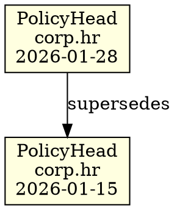

<objective>
Create policy_head_chain_to_dot() function that generates Graphviz DOT format for PolicyHead chain visualization.

Purpose: Enable visual audit trail of policy evolution over time (AUD-02).
Output: Module-level function in policyhead.py with comprehensive test coverage.
</objective>

<execution_context>
@./.claude/get-shit-done/workflows/execute-plan.md
@./.claude/get-shit-done/templates/summary.md
</execution_context>

<context>
@.planning/PROJECT.md
@.planning/ROADMAP.md
@.planning/STATE.md
@.planning/phases/06-audit-trail/06-RESEARCH.md
@src/decisiongraph/policyhead.py
@src/decisiongraph/scholar.py (QueryResult.to_dot pattern - lines 318-415)
@tests/test_policyhead.py
</context>

<tasks>

<task type="auto">
  <name>Task 1: Implement policy_head_chain_to_dot function</name>
  <files>src/decisiongraph/policyhead.py</files>
  <action>
Add a module-level function `policy_head_chain_to_dot(chain: 'Chain', namespace: str) -> str` to policyhead.py.

Follow the exact pattern from QueryResult.to_dot() in scholar.py (lines 318-415):

1. Define helper functions inside the main function:
   ```python
   def _escape_dot_string(s: str) -> str:
       """Escape quotes, backslashes, and newlines for DOT format"""
       return s.replace('\\', '\\\\').replace('"', '\\"').replace('\n', '\\n')

   def _short_id(cell_id: str) -> str:
       """Truncate cell ID to first 12 chars + ellipsis"""
       return cell_id[:12] + "..."
   ```

2. Get PolicyHead chain via get_policy_head_chain(chain, namespace)

3. Build DOT graph with:
   - Header: `digraph policy_chain {`
   - Comment: `// PolicyHead Chain: {namespace}`
   - Graph settings: `rankdir=TB;` and `node [shape=box, style=filled];`
   - PolicyHead nodes (newest first via reversed()): lightyellow fill, label with "PolicyHead\n{namespace}\n{date}"
   - Chain edges: from current to prev_policy_head with label="supersedes"
   - Footer: `}`

4. Use sorted iteration where order matters for determinism
5. Return "\n".join(lines)

Add to __all__ export list: 'policy_head_chain_to_dot'

DOT format example (from RESEARCH.md):


Note: TYPE_CHECKING import for Chain already exists at top of file.
  </action>
  <verify>
Run: `python -c "from decisiongraph.policyhead import policy_head_chain_to_dot; print('Import OK')"`
  </verify>
  <done>
Function exists, imports successfully, follows QueryResult.to_dot pattern.
  </done>
</task>

<task type="auto">
  <name>Task 2: Add comprehensive tests for DOT visualization</name>
  <files>tests/test_policyhead.py</files>
  <action>
Add a new test class `TestPolicyHeadChainToDot` to tests/test_policyhead.py with the following tests:

1. `test_dot_output_is_valid_graphviz`:
   - Create chain with one PolicyHead
   - Call policy_head_chain_to_dot()
   - Assert contains: "digraph policy_chain {", "rankdir=TB;", "node [shape=box, style=filled];"
   - Assert ends with "}"

2. `test_dot_output_contains_namespace_comment`:
   - Create chain with PolicyHead for "corp.hr"
   - Assert DOT contains "// PolicyHead Chain: corp.hr"

3. `test_dot_output_shows_policy_head_nodes`:
   - Create chain with 2 PolicyHeads
   - Assert DOT contains 2 node definitions with "fillcolor=lightyellow"
   - Assert node labels contain "PolicyHead" and namespace

4. `test_dot_output_shows_chain_edges`:
   - Create chain with 3 PolicyHeads properly linked
   - Assert DOT contains edge definitions with "supersedes" label
   - Assert 2 edges exist (ph3->ph2, ph2->ph1)

5. `test_dot_output_empty_namespace`:
   - Create chain with no PolicyHeads for namespace
   - Call policy_head_chain_to_dot() for nonexistent namespace
   - Assert returns valid DOT graph (header + footer, no nodes)

6. `test_dot_output_deterministic`:
   - Create chain with multiple PolicyHeads
   - Call policy_head_chain_to_dot() twice
   - Assert both outputs are identical

7. `test_dot_output_node_id_truncation`:
   - Create chain with PolicyHead
   - Assert node ID in DOT is truncated to 12 chars + "..."
   - Format: "ph_abc123def4..."

8. `test_dot_output_escapes_special_characters`:
   - Create PolicyHead (namespace won't have special chars, but test the escaping mechanism works)
   - Assert no raw quotes or backslashes break DOT syntax

Import policy_head_chain_to_dot at top of file.
Use existing test fixtures (@pytest.fixture def test_chain).
Use T1, T2, T3 time constants from test_utils.
  </action>
  <verify>
Run: `cd /workspaces/Decisiongraph-core-v1.3/decisiongraph-complete && python -m pytest tests/test_policyhead.py::TestPolicyHeadChainToDot -v`
  </verify>
  <done>
All 8 DOT visualization tests pass, covering all AUD-02 requirements.
  </done>
</task>

<task type="auto">
  <name>Task 3: Verify full test suite passes</name>
  <files>tests/test_policyhead.py</files>
  <action>
Run the complete test suite to ensure:
1. All new DOT tests pass
2. All existing policyhead tests still pass (including 06-01 audit text tests if they exist)
3. No regressions introduced

Also run the full project test suite to catch any cross-module issues.
  </action>
  <verify>
Run: `cd /workspaces/Decisiongraph-core-v1.3/decisiongraph-complete && python -m pytest tests/test_policyhead.py -v`
Run: `cd /workspaces/Decisiongraph-core-v1.3/decisiongraph-complete && python -m pytest tests/ -v --tb=short`
Expected: All tests pass
  </verify>
  <done>
Full test suite passes with no regressions (existing + audit text + DOT tests).
  </done>
</task>

</tasks>

<verification>
1. `python -c "from decisiongraph.policyhead import policy_head_chain_to_dot"` succeeds
2. `python -m pytest tests/test_policyhead.py::TestPolicyHeadChainToDot -v` all pass
3. `python -m pytest tests/test_policyhead.py -v` all pass (no regressions)
4. `python -m pytest tests/ -v` all project tests pass
</verification>

<success_criteria>
- policy_head_chain_to_dot() function exists in policyhead.py
- Function exported via __all__
- Function produces valid Graphviz DOT syntax
- DOT output includes: graph structure, PolicyHead nodes, chain edges with "supersedes" labels
- Output is deterministic (same chain = same DOT)
- 8 new tests validate all DOT visualization requirements
- All existing tests still pass (including 06-01 audit text tests)
- Phase 6 requirements AUD-01 and AUD-02 are complete
</success_criteria>

<output>
After completion, create `.planning/phases/06-audit-trail/06-02-SUMMARY.md`
</output>
