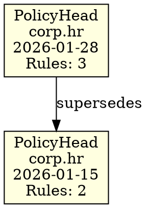

# Phase 6 Plan 02: PolicyHead Chain DOT Visualization Summary

**One-liner:** Graphviz DOT format for PolicyHead chain visualization with supersedes edges

## What Was Built

Implemented `policy_head_chain_to_dot()` function that generates Graphviz DOT format for visualizing PolicyHead chain evolution, following the established QueryResult.to_dot() pattern from scholar.py.

### DOT Output Format



### Key Features

1. **Valid Graphviz Syntax**: Output can be rendered with `dot -Tpng` or online tools
2. **Deterministic Output**: Same chain + namespace always produces identical DOT
3. **Truncated Node IDs**: cell_id truncated to 12 chars + ellipsis
4. **Supersedes Edges**: Show policy evolution from current to previous
5. **Node Labels**: Include PolicyHead, namespace, date, and rule count
6. **Empty Namespace Handling**: Returns valid minimal DOT graph

## Technical Details

### Function Signature

```python
def policy_head_chain_to_dot(chain: 'Chain', namespace: str) -> str:
    """Generate Graphviz DOT format for PolicyHead chain visualization."""
```

### Implementation Notes

- Uses `get_policy_head_chain()` to get ordered PolicyHead list
- Uses `parse_policy_data()` to extract prev_policy_head for edges
- Helper functions `_escape_dot_string()` and `_short_id()` defined inline
- Nodes processed newest-first via `reversed()` for visual clarity
- Edges created from current to prev_policy_head

### Usage

```python
# Generate DOT format
dot_text = policy_head_chain_to_dot(chain, "corp.hr")

# Save to file
with open('policy_chain.dot', 'w') as f:
    f.write(dot_text)

# Render with Graphviz: dot -Tpng policy_chain.dot -o policy_chain.png
```

## Tests Added

| Test | Purpose |
|------|---------|
| test_dot_output_is_valid_graphviz | Valid DOT syntax structure |
| test_dot_output_contains_namespace_comment | Namespace comment in header |
| test_dot_output_shows_policy_head_nodes | Node definitions with fillcolor |
| test_dot_output_shows_chain_edges | Edges with supersedes labels |
| test_dot_output_empty_namespace | Minimal valid DOT for empty namespace |
| test_dot_output_deterministic | Same input = same output |
| test_dot_output_node_id_truncation | Node IDs truncated to 12 chars |
| test_dot_output_escapes_special_characters | Proper DOT string escaping |

## Commits

```
87bc2fa feat(06-02): implement policy_head_chain_to_dot function
eff030c test(06-02): add comprehensive tests for policy_head_chain_to_dot
```

## Deviations from Plan

None - plan executed exactly as written.

## Test Results

- **Tests Added:** 8 (TestPolicyHeadChainToDot class)
- **Total PolicyHead Tests:** 74 (66 from 06-01 + 8 new)
- **Full Suite:** 753 tests passing, no regressions

## Phase 6 Complete

With Plan 06-02 complete, Phase 6 (Audit Trail) is now finished:

| Plan | Requirement | Status |
|------|-------------|--------|
| 06-01 | AUD-01: policy_head_to_audit_text() | Complete |
| 06-02 | AUD-02: policy_head_chain_to_dot() | Complete |

Both audit trail outputs are:
- Deterministic (same input = same output)
- Follow established patterns from scholar.py
- Fully tested with comprehensive test coverage

## v1.5 Milestone Complete

All phases of v1.5 are now complete:

| Phase | Name | Status |
|-------|------|--------|
| 01 | PolicyHead Foundation | Complete |
| 02 | WitnessSet Registry | Complete |
| 03 | Scholar Integration | Complete |
| 04 | Promotion Workflow | Complete |
| 05 | Policy Integrity | Complete |
| 06 | Audit Trail | Complete |
