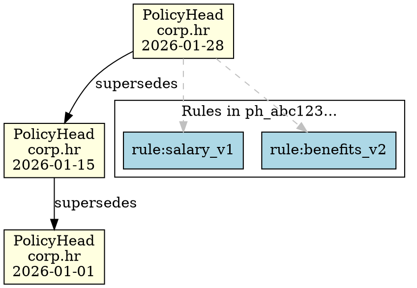

# Phase 6: Audit Trail - Research

**Researched:** 2026-01-28
**Domain:** Human-readable audit output and DOT visualization for PolicyHead chains
**Confidence:** HIGH

## Summary

This research investigates how to implement `to_audit_text()` and `to_dot()` methods for PolicyHead cells, enabling human-readable audit reports and Graphviz visualizations of policy evolution over time.

The codebase already has established patterns for both methods in `QueryResult` (scholar.py), providing a clear template to follow. The implementation will add methods to the policyhead.py module (not to DecisionCell directly) since PolicyHead visualization is domain-specific and requires policy-aware data extraction.

**Primary recommendation:** Create module-level functions `policy_head_to_audit_text(policy_head)` and `policy_head_chain_to_dot(chain, namespace)` in policyhead.py following the exact formatting patterns from QueryResult, ensuring deterministic output.

## Standard Stack

The implementation uses only Python standard library (no external dependencies required).

### Core
| Library | Version | Purpose | Why Standard |
|---------|---------|---------|--------------|
| Python dataclasses | 3.10+ | Data structures | Already in use throughout codebase |
| Python json | stdlib | Policy data parsing | Already used for parse_policy_data() |
| Python base64 | stdlib | Signature display | Already used in policyhead.py |

### Supporting
| Library | Version | Purpose | When to Use |
|---------|---------|---------|-------------|
| typing | stdlib | Type hints | For function signatures |

### Alternatives Considered
| Instead of | Could Use | Tradeoff |
|------------|-----------|----------|
| Module functions | DecisionCell methods | Module functions preferred - PolicyHead is domain-specific, DecisionCell is generic |
| Graphviz Python | Raw DOT strings | Raw DOT strings avoid dependency, match existing pattern |

**Installation:**
```bash
# No additional dependencies required
```

## Architecture Patterns

### Existing Pattern: QueryResult.to_audit_text() and to_dot()

The codebase already has the exact pattern we need in `scholar.py` (lines 215-415). Key observations:

1. **to_audit_text()** produces a multi-line string with:
   - Header section with title and separator
   - Labeled sections for Query Info, Authorization, Results, Proof Details
   - Truncated cell IDs (first 16 chars + "...")
   - Deterministic output (same input = same output)

2. **to_dot()** produces valid Graphviz DOT syntax with:
   - `digraph` wrapper
   - Node definitions with colors (lightblue, lightgreen, lightyellow, lightgray)
   - Edge definitions with labels and colors
   - Special character escaping for DOT format
   - Truncated node IDs (first 12 chars + "...")

### Recommended Module Structure

```
src/decisiongraph/policyhead.py
  # Existing functions...

  # NEW: Audit Trail (AUD-01, AUD-02)
  + policy_head_to_audit_text(policy_head: DecisionCell) -> str
  + policy_head_chain_to_dot(chain: Chain, namespace: str) -> str
```

### Pattern 1: PolicyHead Audit Text Format (AUD-01)
**What:** Human-readable report showing PolicyHead contents
**When to use:** Auditing, debugging, compliance documentation
**Example:**
```text
POLICYHEAD AUDIT REPORT
==================================================

Policy Snapshot:
  Namespace: corp.hr
  Cell ID: a1b2c3d4e5f6...
  System Time: 2026-01-28T10:00:00Z

Policy Hash:
  Hash: abc123def456...
  Promoted Rules: 3
    - rule:salary_v1 (abc123...)
    - rule:benefits_v2 (def456...)
    - rule:vacation_v1 (ghi789...)

Chain Link:
  Previous PolicyHead: xyz789...

Witness Signatures:
  Threshold: 2 of 3
  Signatures Collected: 2
    - alice: VERIFIED
    - bob: VERIFIED

Promotion Context:
  Submitter: admin:alice
  Justification: Annual policy update

Schema Version: 1.5
```

### Pattern 2: PolicyHead Chain DOT Format (AUD-02)
**What:** Graphviz visualization showing policy evolution over time
**When to use:** Visual audit trail, policy change tracking
**Example:**


### Anti-Patterns to Avoid
- **Mutable state in visualization:** Never modify PolicyHead during to_audit_text/to_dot
- **Non-deterministic output:** Avoid datetime.now() or random values - use only data from the PolicyHead itself
- **External dependencies:** Don't require graphviz Python library - output raw DOT strings

## Don't Hand-Roll

Problems that look simple but have existing solutions:

| Problem | Don't Build | Use Instead | Why |
|---------|-------------|-------------|-----|
| DOT escaping | Custom escape logic | Copy `_escape_dot_string()` from scholar.py | Already handles quotes, backslashes, newlines |
| Cell ID truncation | Custom slicing | Copy `_short_id()` pattern from scholar.py | Consistent 12/16 char convention |
| JSON parsing | Manual string manipulation | Use `parse_policy_data()` from policyhead.py | Already handles PolicyHead structure |
| Base64 decoding | Manual decode | Use existing base64 pattern in policyhead.py | Handles signature display |

**Key insight:** The codebase already has all helper patterns needed. Copy them rather than reinvent.

## Common Pitfalls

### Pitfall 1: Non-Deterministic Output
**What goes wrong:** Using dynamic timestamps or random ordering causes different outputs for same input
**Why it happens:** Temptation to add "generated at" timestamps
**How to avoid:** Only use data from the PolicyHead itself. For "generated" timestamp, use the PolicyHead's system_time.
**Warning signs:** Tests fail intermittently, or multiple calls produce different output

### Pitfall 2: Missing Signature Display
**What goes wrong:** Signatures stored as base64 but not decoded for display
**Why it happens:** Forgetting that witness_signatures are base64-encoded in policy_data
**How to avoid:** Use base64.b64decode for display, show "VERIFIED" status not raw bytes
**Warning signs:** Audit text shows base64 gibberish instead of verification status

### Pitfall 3: DOT Syntax Errors
**What goes wrong:** Generated DOT fails to render in Graphviz
**Why it happens:** Unescaped special characters in labels, missing quotes
**How to avoid:** Use `_escape_dot_string()` helper for all label content
**Warning signs:** Graphviz errors like "syntax error" or missing nodes

### Pitfall 4: Forgetting PromotionRequest Context
**What goes wrong:** Audit text missing submitter_id and justification
**Why it happens:** This data is in PromotionRequest, not PolicyHead
**How to avoid:** PromotionRequest.submitter_id is stored in PolicyHead.proof.signer_id (set via `creator` parameter). Justification is NOT currently stored (see Open Questions).
**Warning signs:** Audit text shows "Submitter: None"

## Code Examples

### Example 1: Audit Text Structure (from QueryResult pattern)

```python
# Source: scholar.py lines 215-316
def policy_head_to_audit_text(policy_head: DecisionCell) -> str:
    """
    Generate human-readable audit report for a PolicyHead.

    Same deterministic guarantee as QueryResult.to_audit_text().
    """
    from .policyhead import parse_policy_data

    lines = []

    # Header
    lines.append("POLICYHEAD AUDIT REPORT")
    lines.append("=" * 50)
    lines.append("")

    # Policy Snapshot section
    lines.append("Policy Snapshot:")
    lines.append(f"  Namespace: {policy_head.fact.namespace}")
    lines.append(f"  Cell ID: {policy_head.cell_id[:16]}...")
    lines.append(f"  System Time: {policy_head.header.system_time}")
    lines.append("")

    # Parse policy data
    policy_data = parse_policy_data(policy_head)

    # Policy Hash section
    lines.append("Policy Hash:")
    lines.append(f"  Hash: {policy_data['policy_hash'][:16]}...")
    rules = policy_data["promoted_rule_ids"]
    lines.append(f"  Promoted Rules: {len(rules)}")
    for rule_id in rules:
        lines.append(f"    - {rule_id}")
    lines.append("")

    # Chain Link section
    prev = policy_data.get("prev_policy_head")
    lines.append("Chain Link:")
    if prev:
        lines.append(f"  Previous PolicyHead: {prev[:16]}...")
    else:
        lines.append("  Previous PolicyHead: (genesis - first policy)")
    lines.append("")

    # Witness Signatures section
    sigs = policy_data.get("witness_signatures", {})
    lines.append("Witness Signatures:")
    lines.append(f"  Signatures Collected: {len(sigs)}")
    for witness_id in sorted(sigs.keys()):
        # Show witness ID, signature verification would require public key
        lines.append(f"    - {witness_id}: (signature present)")
    lines.append("")

    # Promotion Context
    lines.append("Promotion Context:")
    submitter = policy_head.proof.signer_id or "unknown"
    lines.append(f"  Submitter: {submitter}")
    lines.append("")

    # Footer
    lines.append(f"Schema Version: {policy_head.header.version}")

    return "\n".join(lines)
```

### Example 2: DOT Structure (from QueryResult pattern)

```python
# Source: scholar.py lines 318-415
def policy_head_chain_to_dot(chain: 'Chain', namespace: str) -> str:
    """
    Generate Graphviz DOT for PolicyHead chain visualization.

    Shows policy evolution over time with:
    - PolicyHead nodes (lightyellow)
    - Chain edges (supersedes links)
    - Promoted rule nodes (lightblue)
    """
    from .policyhead import get_policy_head_chain, parse_policy_data

    def _escape_dot_string(s: str) -> str:
        return s.replace('\\', '\\\\').replace('"', '\\"').replace('\n', '\\n')

    def _short_id(cell_id: str) -> str:
        return cell_id[:12] + "..."

    lines = []

    # Get PolicyHead chain (oldest to newest)
    policy_heads = get_policy_head_chain(chain, namespace)

    # Graph header
    lines.append("digraph policy_chain {")
    lines.append(f"  // PolicyHead Chain: {namespace}")
    lines.append("  rankdir=TB;")
    lines.append("  node [shape=box, style=filled];")
    lines.append("")

    # PolicyHead nodes (reverse order - newest first)
    lines.append("  // PolicyHead nodes")
    for ph in reversed(policy_heads):
        node_id = f"ph_{_short_id(ph.cell_id)}"
        date = ph.header.system_time[:10]  # Just the date part
        label = f"PolicyHead\\n{_escape_dot_string(namespace)}\\n{date}"
        lines.append(f'  "{node_id}" [label="{label}", fillcolor=lightyellow];')
    lines.append("")

    # Chain edges (prev_policy_head links)
    lines.append("  // Chain edges")
    for ph in policy_heads:
        data = parse_policy_data(ph)
        prev = data.get("prev_policy_head")
        if prev:
            from_id = f"ph_{_short_id(ph.cell_id)}"
            to_id = f"ph_{_short_id(prev)}"
            lines.append(f'  "{from_id}" -> "{to_id}" [label="supersedes"];')
    lines.append("")

    # Graph footer
    lines.append("}")

    return "\n".join(lines)
```

## State of the Art

| Old Approach | Current Approach | When Changed | Impact |
|--------------|------------------|--------------|--------|
| No PolicyHead visualization | Add to_audit_text/to_dot for PolicyHead | v1.5 (this phase) | Enables audit compliance |

**Deprecated/outdated:**
- N/A - this is new functionality

## Open Questions

Things that couldn't be fully resolved:

1. **Justification Field Storage**
   - What we know: PromotionRequest has `submitter_id` but no `justification` field
   - What's unclear: Success criteria mentions "justification from PromotionRequest" but no justification field exists
   - Recommendation: Either (a) add `justification` field to PromotionRequest and store in PolicyHead, or (b) clarify that justification is optional/future scope

2. **Signature Verification Display**
   - What we know: PolicyHead stores base64 signatures and canonical_payload
   - What's unclear: Should to_audit_text() verify signatures and show "VERIFIED/INVALID", or just show "present"?
   - Recommendation: Show "present" for simple audit, add separate `verify_and_audit()` function if verification display needed

3. **Promoted Rule Details**
   - What we know: PolicyHead stores rule_ids (cell_ids of promoted rules)
   - What's unclear: Should audit text show rule subject/predicate, or just IDs?
   - Recommendation: Show rule IDs only (fetching rule details requires chain access which complicates function signature)

## Sources

### Primary (HIGH confidence)
- scholar.py lines 215-415 - Existing to_audit_text() and to_dot() patterns
- policyhead.py - PolicyHead structure, parse_policy_data()
- test_lineage_visualizer.py - Test patterns for VIS-01, VIS-02

### Secondary (MEDIUM confidence)
- PROJECT.md, ROADMAP.md - Requirements AUD-01, AUD-02

### Tertiary (LOW confidence)
- N/A

## Metadata

**Confidence breakdown:**
- Standard stack: HIGH - No external dependencies, pure Python
- Architecture: HIGH - Following existing patterns from QueryResult
- Pitfalls: HIGH - Based on codebase analysis and existing test patterns

**Research date:** 2026-01-28
**Valid until:** 2026-02-28 (30 days - stable pattern, internal codebase)

---

## Recommended Plan Structure

Based on this research, Phase 6 should have 2 plans:

### Plan 06-01: PolicyHead.to_audit_text() (AUD-01)

**Tasks:**
1. Add `policy_head_to_audit_text(policy_head: DecisionCell) -> str` function to policyhead.py
2. Include sections: Policy Snapshot, Policy Hash, Chain Link, Witness Signatures, Promotion Context
3. Ensure deterministic output (sorted keys, consistent formatting)
4. Add tests following test_lineage_visualizer.py patterns

**Files:**
- src/decisiongraph/policyhead.py (add function)
- tests/test_policyhead.py (add audit text tests)

### Plan 06-02: PolicyHead.to_dot() (AUD-02)

**Tasks:**
1. Add `policy_head_chain_to_dot(chain: Chain, namespace: str) -> str` function to policyhead.py
2. Include: PolicyHead nodes (lightyellow), chain edges, optional rule nodes
3. Use existing DOT patterns from scholar.py
4. Add tests for valid DOT syntax and determinism

**Files:**
- src/decisiongraph/policyhead.py (add function)
- tests/test_policyhead.py (add DOT tests)

### Data Available for Audit Trail

From PolicyHead cell and parsed policy_data:

| Field | Source | Available |
|-------|--------|-----------|
| namespace | policy_head.fact.namespace | YES |
| cell_id | policy_head.cell_id | YES |
| system_time | policy_head.header.system_time | YES |
| policy_hash | policy_data["policy_hash"] | YES |
| promoted_rule_ids | policy_data["promoted_rule_ids"] | YES |
| prev_policy_head | policy_data["prev_policy_head"] | YES |
| witness_signatures | policy_data["witness_signatures"] | YES (base64) |
| canonical_payload | policy_data["canonical_payload"] | YES (base64) |
| submitter_id | policy_head.proof.signer_id | YES (from creator param) |
| justification | N/A | NO - not stored |
| schema_version | policy_head.header.version | YES |
