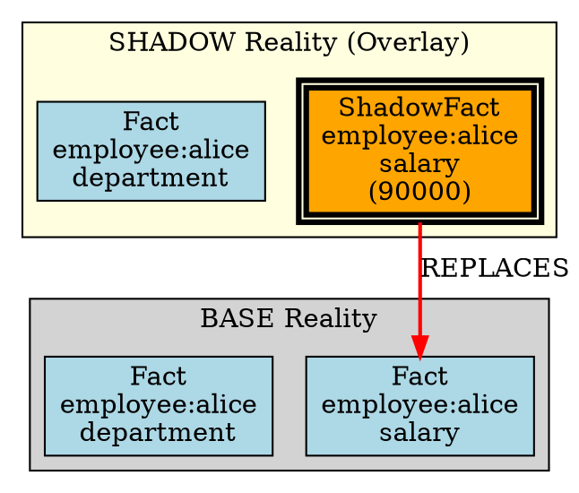

# Phase 12: Audit Trail - Research

**Researched:** 2026-01-28
**Domain:** Human-readable simulation audit reports and BASE vs SHADOW lineage visualization
**Confidence:** HIGH

## Summary

Phase 12 adds human-readable audit output and visualization capabilities to SimulationResult objects, enabling compliance reporting and visual analysis of counterfactual simulations. This research investigates how to implement oracle.to_audit_text() and oracle.to_dot() methods for simulation results, building on established patterns from QueryResult (v1.2) and PolicyHead (v1.5).

The codebase already has mature patterns for both audit text and DOT visualization. QueryResult.to_audit_text() (scholar.py lines 215-316) and policy_head_to_audit_text() (policyhead.py lines 686-777) provide the structural template: multi-section reports with headers, deterministic formatting, truncated IDs, and sorted outputs. Similarly, QueryResult.to_dot() (scholar.py lines 318-415) demonstrates Graphviz DOT generation with proper escaping, color-coded nodes, and labeled edges.

Phase 12's unique requirement is BASE vs SHADOW comparison visualization - showing how shadow overlay cells differ from base reality in a single unified view. This requires extending existing patterns to handle dual-origin lineage graphs where nodes are color-tagged by origin (BASE=lightblue, SHADOW=orange) and delta highlights show verdict changes.

**Primary recommendation:** Add simulation_result_to_audit_text(sim_result) and simulation_result_to_dot(sim_result) as module-level functions in simulation.py, following the exact formatting conventions from QueryResult and PolicyHead patterns. Use proof_bundle["base"] and proof_bundle["shadow"] tagged bundles (already created in Phase 9) as data sources.

## Standard Stack

Implementation uses only Python standard library - no external dependencies required.

### Core
| Library | Version | Purpose | Why Standard |
|---------|---------|---------|--------------|
| Python dataclasses | 3.10+ | SimulationResult structure | Already used in simulation.py |
| Python json | stdlib | Parse proof bundles | Already used throughout codebase |
| Python hashlib | stdlib | Display attestation hashes | Already used in simulation.py |

### Supporting
| Library | Version | Purpose | When to Use |
|---------|---------|---------|-------------|
| typing | stdlib | Type hints | For function signatures |
| copy | stdlib | Deep copy (if needed) | Only if proof bundle modification required |

### Alternatives Considered
| Instead of | Could Use | Tradeoff |
|------------|-----------|----------|
| Module functions | SimulationResult methods | Module functions preferred - matches QueryResult pattern, avoids dataclass method bloat |
| Graphviz Python library | Raw DOT strings | Raw DOT strings avoid dependency, match existing pattern |
| Custom escaping | graphviz.escape() | Custom _escape_dot_string() already exists, maintain consistency |

**Installation:**
```bash
# No additional dependencies required
```

## Architecture Patterns

### Existing Pattern: QueryResult and PolicyHead Audit/Visualization

The codebase has two established audit trail patterns:

1. **QueryResult.to_audit_text()** (scholar.py:215-316):
   - Multi-section report: Query Info, Authorization, Results, Proof Details
   - Truncated cell IDs (first 16 chars + "...")
   - Deterministic output (sorted lists, stable order)
   - Human-readable status ("ALLOWED"/"DENIED")

2. **QueryResult.to_dot()** (scholar.py:318-415):
   - Valid Graphviz DOT syntax
   - Color-coded nodes (lightblue=facts, lightgreen=bridges, lightgray=candidates)
   - Labeled edges (authorization, resolution)
   - Special character escaping via _escape_dot_string()
   - Truncated node IDs (first 12 chars + "...")

3. **policy_head_to_audit_text()** (policyhead.py:686-777):
   - Similar structure: sections with headers and separators
   - Shows policy hash, promoted rules, witness signatures
   - Deterministic ordering (sorted witness IDs)

### Recommended Module Structure

```
src/decisiongraph/simulation.py
  # Existing (Phase 8-11)
  - SimulationContext
  - SimulationResult
  - DeltaReport
  - compute_delta_report()
  - tag_proof_bundle_origin()

  # NEW (Phase 12: AUD-01, AUD-03)
  + simulation_result_to_audit_text(sim_result: SimulationResult) -> str
  + simulation_result_to_dot(sim_result: SimulationResult) -> str
```

### Pattern 1: Simulation Audit Text Format (AUD-01)
**What:** Human-readable report showing base vs shadow comparison with delta analysis
**When to use:** Compliance documentation, debugging simulations, stakeholder reporting
**Example:**
```text
SIMULATION AUDIT REPORT
==================================================

Simulation Context:
  Simulation ID: sim-abc123...
  RFA Hash: def456...
  Simulation Spec Hash: ghi789...
  Valid Time: 2025-01-15T00:00:00Z
  System Time: 2025-01-15T00:00:00Z

BASE Reality:
  Facts Returned: 3
  Authorization: ALLOWED
  Fact Cells:
    - abc123... (employee:alice salary 85000)
    - def456... (employee:alice department hr)
    - ghi789... (employee:alice status active)

SHADOW Reality:
  Facts Returned: 3
  Authorization: ALLOWED
  Fact Cells:
    - abc123_shadow... (employee:alice salary 90000)  [MODIFIED]
    - def456... (employee:alice department hr)
    - ghi789... (employee:alice status active)

DELTA Analysis:
  Verdict Changed: false
  Status Change: ALLOWED -> ALLOWED
  Score Delta: 0.0
  Facts Diff:
    Added: 0
    Removed: 0
    Modified: 1 (abc123_shadow... replaced abc123...)
  Rules Diff:
    Added: 0
    Removed: 0

Counterfactual Anchors:
  Anchors Detected: 1
  Minimal Changes:
    - shadow_fact:abc123... (object: 85000 -> 90000)

Contamination Attestation:
  Chain Head Before: xyz789...
  Chain Head After: xyz789...
  Contamination Detected: false
  Attestation Hash: aaa111...

Overlay Metadata:
  Shadow Facts: 1
  Shadow Rules: 0
  Shadow PolicyHeads: 0
  Shadow Bridges: 0

Schema Version: 1.6
```

### Pattern 2: BASE vs SHADOW DOT Visualization (AUD-03)
**What:** Dual-origin lineage graph with color-coded BASE/SHADOW nodes and delta highlighting
**When to use:** Visual debugging, stakeholder presentations, documentation
**Example:**


### Anti-Patterns to Avoid
- **Mutable state during rendering:** Never modify SimulationResult during to_audit_text/to_dot - it's frozen
- **Non-deterministic output:** Avoid dynamic timestamps - use data from SimulationResult itself
- **Inconsistent ID truncation:** Always use 16 chars for audit text, 12 chars for DOT (match existing patterns)
- **Missing origin tagging:** Every node in DOT must be tagged with BASE or SHADOW origin
- **Unescaped DOT strings:** Always escape quotes, backslashes, newlines in DOT labels

## Don't Hand-Roll

Problems that look simple but have existing solutions:

| Problem | Don't Build | Use Instead | Why |
|---------|-------------|-------------|-----|
| DOT escaping | Custom escape logic | Copy `_escape_dot_string()` from scholar.py | Already handles quotes, backslashes, newlines correctly |
| Cell ID truncation | Manual slicing | Copy `_short_id()` pattern from scholar.py | Consistent 12/16 char convention across codebase |
| Proof bundle parsing | Manual dict traversal | Use proof_bundle["base"] and proof_bundle["shadow"] from Phase 9 | Already tagged with origin markers |
| Hash display | Full hash strings | Truncate to 16 chars + "..." | Matches existing audit text convention |
| Delta comparison | Custom diff logic | Use existing delta_report from SimulationResult | Already computed in Phase 9 |
| Anchor display | Custom formatting | Use anchors dict from SimulationResult | Already available from Phase 10 |

**Key insight:** Phase 9, 10, 11 already computed all necessary data (delta_report, anchors, tagged proof_bundles, contamination_attestation). Phase 12 is pure formatting - extracting existing data and rendering it human-readable.

## Common Pitfalls

### Pitfall 1: Forgetting Origin Tags from Phase 9
**What goes wrong:** DOT graph shows cells but doesn't distinguish BASE from SHADOW
**Why it happens:** proof_bundle has nested "base" and "shadow" keys, easy to miss
**How to avoid:** Always use proof_bundle["base"]["origin"] and proof_bundle["shadow"]["origin"] to determine node color
**Warning signs:** All nodes same color in DOT output, no visual distinction between realities

### Pitfall 2: Non-Deterministic Anchor Display
**What goes wrong:** Anchors shown in different order on repeated runs
**Why it happens:** Iterating over dict/set without sorting
**How to avoid:** Sort anchor list by cell_id before displaying (anchors["anchors"] is list, ensure sorted)
**Warning signs:** Tests fail intermittently, diff shows different anchor order

### Pitfall 3: DOT Syntax Errors from Unescaped Labels
**What goes wrong:** Graphviz rendering fails with "syntax error"
**Why it happens:** Cell subject/predicate contains quotes or backslashes
**How to avoid:** Use _escape_dot_string() for ALL label content, including subject/predicate/object
**Warning signs:** Graphviz errors like "syntax error in line X", missing nodes

### Pitfall 4: Missing Contamination Attestation in Audit Text
**What goes wrong:** Audit report doesn't prove simulation was safe
**Why it happens:** Forgetting to include proof_bundle["contamination_attestation"]
**How to avoid:** Always include "Contamination Attestation" section showing chain_head_before == chain_head_after
**Warning signs:** Audit text missing contamination_detected field, no chain head verification

### Pitfall 5: Inconsistent Section Ordering
**What goes wrong:** Audit text sections in random order, hard to read
**Why it happens:** Building sections dynamically without explicit order
**How to avoid:** Fixed section order: Context → BASE → SHADOW → DELTA → Anchors → Attestation → Metadata
**Warning signs:** Sections appear in different positions, hard to scan visually

## Code Examples

### Example 1: Simulation Audit Text Structure (AUD-01)

```python
# Source: Following QueryResult.to_audit_text() pattern (scholar.py:215-316)
def simulation_result_to_audit_text(sim_result: SimulationResult) -> str:
    """
    Generate human-readable audit report for a simulation.

    Returns deterministic plain text report containing:
    - Simulation Context (simulation_id, RFA hash, simulation_spec hash, timestamps)
    - BASE Reality (facts, authorization, cell IDs)
    - SHADOW Reality (facts, authorization, cell IDs with origin tags)
    - DELTA Analysis (verdict_changed, status change, diffs)
    - Counterfactual Anchors (minimal changes causing delta)
    - Contamination Attestation (chain head verification)
    - Overlay Metadata (shadow cell counts)

    Same SimulationResult always produces identical output (deterministic).

    Args:
        sim_result: SimulationResult from engine.simulate_rfa()

    Returns:
        Multi-line string with audit report

    Example:
        result = engine.simulate_rfa(...)
        report = simulation_result_to_audit_text(result)
        print(report)
    """
    lines = []

    # Header
    lines.append("SIMULATION AUDIT REPORT")
    lines.append("=" * 50)
    lines.append("")

    # Simulation Context
    lines.append("Simulation Context:")
    lines.append(f"  Simulation ID: {sim_result.simulation_id[:16]}...")

    # Compute RFA hash (SHA-256 of canonical RFA JSON)
    import json, hashlib
    rfa_canonical = json.dumps(sim_result.rfa_dict, sort_keys=True, separators=(',', ':'))
    rfa_hash = hashlib.sha256(rfa_canonical.encode('utf-8')).hexdigest()
    lines.append(f"  RFA Hash: {rfa_hash[:16]}...")

    # Compute simulation_spec hash (AUD-02)
    spec_canonical = json.dumps(sim_result.simulation_spec, sort_keys=True, separators=(',', ':'))
    spec_hash = hashlib.sha256(spec_canonical.encode('utf-8')).hexdigest()
    lines.append(f"  Simulation Spec Hash: {spec_hash[:16]}...")

    lines.append(f"  Valid Time: {sim_result.at_valid_time}")
    lines.append(f"  System Time: {sim_result.as_of_system_time}")
    lines.append("")

    # BASE Reality
    lines.append("BASE Reality:")
    base_result = sim_result.base_result
    base_facts = base_result.get("results", {}).get("fact_cell_ids", [])
    base_auth = base_result.get("authorization_basis", {})
    base_allowed = "ALLOWED" if base_auth.get("allowed", False) else "DENIED"

    lines.append(f"  Facts Returned: {len(base_facts)}")
    lines.append(f"  Authorization: {base_allowed}")
    if base_facts:
        lines.append("  Fact Cells:")
        for fact_id in base_facts:
            lines.append(f"    - {fact_id[:16]}...")
    lines.append("")

    # SHADOW Reality
    lines.append("SHADOW Reality:")
    shadow_result = sim_result.shadow_result
    shadow_facts = shadow_result.get("results", {}).get("fact_cell_ids", [])
    shadow_auth = shadow_result.get("authorization_basis", {})
    shadow_allowed = "ALLOWED" if shadow_auth.get("allowed", False) else "DENIED"

    lines.append(f"  Facts Returned: {len(shadow_facts)}")
    lines.append(f"  Authorization: {shadow_allowed}")
    if shadow_facts:
        lines.append("  Fact Cells:")
        for fact_id in shadow_facts:
            origin_tag = " [SHADOW]" if fact_id not in base_facts else ""
            lines.append(f"    - {fact_id[:16]}...{origin_tag}")
    lines.append("")

    # DELTA Analysis
    lines.append("DELTA Analysis:")
    delta = sim_result.delta_report
    lines.append(f"  Verdict Changed: {str(delta.verdict_changed).lower()}")
    lines.append(f"  Status Change: {delta.status_before} -> {delta.status_after}")
    lines.append(f"  Score Delta: {delta.score_delta}")

    lines.append("  Facts Diff:")
    lines.append(f"    Added: {len(delta.facts_diff['added'])}")
    lines.append(f"    Removed: {len(delta.facts_diff['removed'])}")

    lines.append("  Rules Diff:")
    lines.append(f"    Added: {len(delta.rules_diff['added'])}")
    lines.append(f"    Removed: {len(delta.rules_diff['removed'])}")
    lines.append("")

    # Counterfactual Anchors
    lines.append("Counterfactual Anchors:")
    anchors = sim_result.anchors.get("anchors", [])
    lines.append(f"  Anchors Detected: {len(anchors)}")
    if anchors:
        lines.append("  Minimal Changes:")
        for anchor in anchors:
            lines.append(f"    - {anchor}")
    if sim_result.anchors.get("anchors_incomplete", False):
        lines.append("  [INCOMPLETE: Budget exceeded during detection]")
    lines.append("")

    # Contamination Attestation
    lines.append("Contamination Attestation:")
    attestation = sim_result.proof_bundle.get("contamination_attestation", {})
    chain_before = attestation.get("chain_head_before", "")
    chain_after = attestation.get("chain_head_after", "")
    contaminated = attestation.get("contamination_detected", False)

    lines.append(f"  Chain Head Before: {chain_before[:16]}...")
    lines.append(f"  Chain Head After: {chain_after[:16]}...")
    lines.append(f"  Contamination Detected: {str(contaminated).lower()}")

    attest_hash = attestation.get("attestation_hash", "")
    lines.append(f"  Attestation Hash: {attest_hash[:16]}...")
    lines.append("")

    # Overlay Metadata (AUD-02: record overlay cell hashes)
    lines.append("Overlay Metadata:")
    spec = sim_result.simulation_spec
    lines.append(f"  Shadow Facts: {len(spec.get('shadow_facts', []))}")
    lines.append(f"  Shadow Rules: {len(spec.get('shadow_rules', []))}")
    lines.append(f"  Shadow PolicyHeads: {len(spec.get('shadow_policy_heads', []))}")
    lines.append(f"  Shadow Bridges: {len(spec.get('shadow_bridges', []))}")
    lines.append("")

    # Footer
    lines.append("Schema Version: 1.6")
    lines.append(f"Generated: {sim_result.as_of_system_time}")

    return "\n".join(lines)
```

### Example 2: BASE vs SHADOW DOT Visualization (AUD-03)

```python
# Source: Following QueryResult.to_dot() pattern (scholar.py:318-415)
def simulation_result_to_dot(sim_result: SimulationResult) -> str:
    """
    Generate Graphviz DOT format for BASE vs SHADOW lineage visualization.

    Creates dual-origin graph showing:
    - BASE nodes (lightblue) - production reality
    - SHADOW nodes (orange) - overlay modifications
    - Delta edges (red) - what changed
    - Anchor highlighting (double border) - minimal changes

    Output can be rendered with Graphviz:
        $ dot -Tpng simulation.dot -o simulation.png
        $ dot -Tsvg simulation.dot -o simulation.svg

    Same SimulationResult always produces identical output (deterministic).

    Args:
        sim_result: SimulationResult from engine.simulate_rfa()

    Returns:
        String containing valid DOT syntax

    Example:
        result = engine.simulate_rfa(...)
        dot_text = simulation_result_to_dot(result)
        with open('simulation.dot', 'w') as f:
            f.write(dot_text)
    """
    def _escape_dot_string(s: str) -> str:
        """Escape quotes, backslashes, and newlines for DOT format"""
        return s.replace('\\', '\\\\').replace('"', '\\"').replace('\n', '\\n')

    def _short_id(cell_id: str) -> str:
        """Truncate cell ID to first 12 chars + ellipsis"""
        return cell_id[:12] + "..."

    lines = []

    # Graph header
    lines.append("digraph simulation_lineage {")
    lines.append(f"  // Simulation: {sim_result.simulation_id[:12]}...")
    lines.append("  rankdir=TB;")
    lines.append("  node [shape=box, style=filled];")
    lines.append("")

    # Extract BASE and SHADOW proof bundles
    base_bundle = sim_result.proof_bundle.get("base", {})
    shadow_bundle = sim_result.proof_bundle.get("shadow", {})

    # Get anchor cell IDs for highlighting
    anchor_cell_ids = set()
    for anchor in sim_result.anchors.get("anchors", []):
        # Extract cell_id from anchor string if present
        # Format: "shadow_fact:abc123..." or "shadow_rule:def456..."
        if ":" in anchor:
            anchor_cell_ids.add(anchor.split(":")[1])

    # BASE subgraph
    lines.append("  subgraph cluster_base {")
    lines.append('    label="BASE Reality";')
    lines.append("    style=filled;")
    lines.append("    fillcolor=lightgray;")
    lines.append("")

    base_facts = base_bundle.get("results", {}).get("fact_cell_ids", [])
    for fact_id in base_facts:
        node_id = f"base_{_short_id(fact_id)}"
        label = f"Fact\\n{_short_id(fact_id)}"
        lines.append(f'    "{node_id}" [label="{label}", fillcolor=lightblue];')

    lines.append("  }")
    lines.append("")

    # SHADOW subgraph
    lines.append("  subgraph cluster_shadow {")
    lines.append('    label="SHADOW Reality (Overlay)";')
    lines.append("    style=filled;")
    lines.append("    fillcolor=lightyellow;")
    lines.append("")

    shadow_facts = shadow_bundle.get("results", {}).get("fact_cell_ids", [])
    for fact_id in shadow_facts:
        node_id = f"shadow_{_short_id(fact_id)}"
        label = f"Fact\\n{_short_id(fact_id)}"

        # Determine fill color (orange if shadow origin)
        if fact_id in base_facts:
            fillcolor = "lightblue"  # Unchanged
        else:
            fillcolor = "orange"  # Shadow overlay

        # Anchor highlighting (double border)
        extra_attrs = ""
        if _short_id(fact_id) in anchor_cell_ids:
            extra_attrs = ", peripheries=2, penwidth=3.0"

        lines.append(f'    "{node_id}" [label="{label}", fillcolor={fillcolor}{extra_attrs}];')

    lines.append("  }")
    lines.append("")

    # Delta edges (what changed)
    lines.append("  // Delta edges")
    for removed_id in sim_result.delta_report.facts_diff.get("removed", []):
        lines.append(f'  "base_{_short_id(removed_id)}" [fillcolor=pink];  // REMOVED')

    for added_id in sim_result.delta_report.facts_diff.get("added", []):
        lines.append(f'  "shadow_{_short_id(added_id)}" [fillcolor=lightgreen];  // ADDED')
    lines.append("")

    # Verdict change annotation
    if sim_result.delta_report.verdict_changed:
        lines.append('  "verdict_delta" [label="VERDICT CHANGED", shape=diamond, fillcolor=red, fontcolor=white];')
        lines.append("")

    # Graph footer
    lines.append("}")

    return "\n".join(lines)
```

## State of the Art

| Old Approach | Current Approach | When Changed | Impact |
|--------------|------------------|--------------|--------|
| No simulation audit trail | Add to_audit_text/to_dot for SimulationResult | v1.6 (this phase) | Enables compliance, debugging, stakeholder reporting |
| Single-reality visualization | Dual-origin BASE vs SHADOW graphs | v1.6 (this phase) | Visual comparison of counterfactual scenarios |
| Manual diff analysis | Automated delta_report rendering | v1.6 (builds on Phase 9) | Faster analysis, consistent formatting |

**Deprecated/outdated:**
- N/A - this is new functionality building on v1.6 simulation infrastructure

## Open Questions

Things that couldn't be fully resolved:

1. **Overlay Cell Hash Display (AUD-02)**
   - What we know: Requirement says "simulation proof bundle records overlay cell hashes"
   - What's unclear: Should audit text show individual shadow cell hashes, or just simulation_spec hash?
   - Recommendation: Show simulation_spec hash (covers all overlay cells) in main audit text, optionally add "Overlay Cell Hashes" section listing each shadow cell's hash for deep auditing

2. **DOT Graph Size Limits**
   - What we know: Large simulations (1000+ facts) will produce massive DOT graphs
   - What's unclear: Should to_dot() limit node count? Truncate large graphs?
   - Recommendation: Start with no limit (user can filter RFA to reduce scope), add max_nodes parameter later if needed

3. **Rule Cell Visualization in DOT**
   - What we know: Current QueryResult.to_dot() shows fact cells, bridge cells, candidates
   - What's unclear: Should simulation DOT show rule cells? PolicyHead cells?
   - Recommendation: Focus on fact cells for MVP (matches QueryResult pattern), add rule/policy visualization in post-release enhancement

4. **Anchor Highlighting Granularity**
   - What we know: Anchors are minimal changes causing verdict delta
   - What's unclear: How to visually distinguish anchor cells from other shadow cells in DOT?
   - Recommendation: Use double border (peripheries=2) for anchor nodes, bold edge weight (penwidth=3.0) for emphasis

5. **Contamination Attestation Failure Display**
   - What we know: contamination_detected should NEVER be true (structural isolation)
   - What's unclear: If it's true (bug), how should audit text highlight this?
   - Recommendation: Add WARNING banner at top of audit text if contamination_detected=true, flag as critical error

## Sources

### Primary (HIGH confidence)
- scholar.py lines 215-415 - QueryResult.to_audit_text() and to_dot() patterns
- policyhead.py lines 686-777 - policy_head_to_audit_text() pattern
- simulation.py lines 1-414 - SimulationResult structure, delta_report, proof_bundle
- Phase 9 RESEARCH.md - Delta computation and proof bundle tagging specifications
- Phase 10 RESEARCH.md - Counterfactual anchors structure and display format
- REQUIREMENTS.md - AUD-01, AUD-02, AUD-03 requirements

### Secondary (MEDIUM confidence)
- [Graphviz DOT Language Documentation](https://graphviz.org/doc/info/lang.html) - Official DOT syntax
- [Graphviz User Guide](https://graphviz.readthedocs.io/en/stable/manual.html) - Python library patterns
- [Audit Trail Requirements 2026](https://influenceflow.io/resources/payments-with-audit-trails-complete-guide-for-2026/) - Industry standards for human-readable formats
- [Shadow Marks Visualization Research (2025)](https://link.springer.com/chapter/10.1007/978-3-032-05005-2_11) - Visual comparison techniques for multiple views

### Tertiary (LOW confidence)
- N/A

## Metadata

**Confidence breakdown:**
- Standard stack: HIGH - No external dependencies, pure Python stdlib
- Architecture: HIGH - Following established QueryResult and PolicyHead patterns exactly
- Pitfalls: HIGH - Based on codebase analysis and existing test patterns from Phase 6

**Research date:** 2026-01-28
**Valid until:** 2026-02-28 (30 days - stable pattern, internal codebase)

---

## Recommended Plan Structure

Based on this research, Phase 12 should have 2 plans:

### Plan 12-01: SimulationResult.to_audit_text() (AUD-01, AUD-02)

**Tasks:**
1. Add `simulation_result_to_audit_text(sim_result: SimulationResult) -> str` function to simulation.py
2. Include sections: Context, BASE Reality, SHADOW Reality, DELTA Analysis, Anchors, Attestation, Metadata
3. Compute and display RFA hash and simulation_spec hash (AUD-02)
4. Ensure deterministic output (sorted lists, consistent formatting)
5. Add comprehensive tests following test_lineage_visualizer.py patterns

**Files:**
- src/decisiongraph/simulation.py (add function)
- tests/test_simulation.py (add audit text tests)

**Success Criteria:**
- User can call simulation_result_to_audit_text(result) and receive human-readable report
- Report shows BASE vs SHADOW comparison with delta analysis
- RFA hash and simulation_spec hash recorded for auditability
- Same SimulationResult produces identical output (deterministic)

### Plan 12-02: SimulationResult.to_dot() (AUD-03)

**Tasks:**
1. Add `simulation_result_to_dot(sim_result: SimulationResult) -> str` function to simulation.py
2. Create dual-origin graph with BASE (lightblue) and SHADOW (orange) subgraphs
3. Color-tag nodes by origin from proof_bundle["base"]/["shadow"]
4. Highlight anchors with double borders
5. Show delta edges (removed=pink, added=lightgreen)
6. Add tests for valid DOT syntax and determinism

**Files:**
- src/decisiongraph/simulation.py (add function)
- tests/test_simulation.py (add DOT tests)

**Success Criteria:**
- User can call simulation_result_to_dot(result) and receive valid Graphviz DOT
- Graph shows BASE vs SHADOW lineage with color-coding
- Verdict changes and anchors visually highlighted
- Same SimulationResult produces identical DOT output (deterministic)

### Data Available for Audit Trail

From SimulationResult and nested structures:

| Field | Source | Available | Notes |
|-------|--------|-----------|-------|
| simulation_id | sim_result.simulation_id | YES | Unique identifier |
| rfa_dict | sim_result.rfa_dict | YES | Original RFA request |
| simulation_spec | sim_result.simulation_spec | YES | Shadow cell specs |
| base_result | sim_result.base_result | YES | Proof bundle from base query |
| shadow_result | sim_result.shadow_result | YES | Proof bundle from shadow query |
| at_valid_time | sim_result.at_valid_time | YES | Valid-time coordinate |
| as_of_system_time | sim_result.as_of_system_time | YES | System-time coordinate |
| delta_report | sim_result.delta_report | YES | Computed in Phase 9 |
| anchors | sim_result.anchors | YES | Detected in Phase 10 |
| proof_bundle["base"] | sim_result.proof_bundle["base"] | YES | Tagged in Phase 9 |
| proof_bundle["shadow"] | sim_result.proof_bundle["shadow"] | YES | Tagged in Phase 9 |
| contamination_attestation | sim_result.proof_bundle["contamination_attestation"] | YES | Created in Phase 9 |
| rfa_hash | Computed from rfa_dict | COMPUTE | SHA-256 of canonical JSON |
| simulation_spec_hash | Computed from simulation_spec | COMPUTE | SHA-256 of canonical JSON |
| overlay_cell_hashes | From simulation_spec cells | COMPUTE | SHA-256 of each shadow cell |
