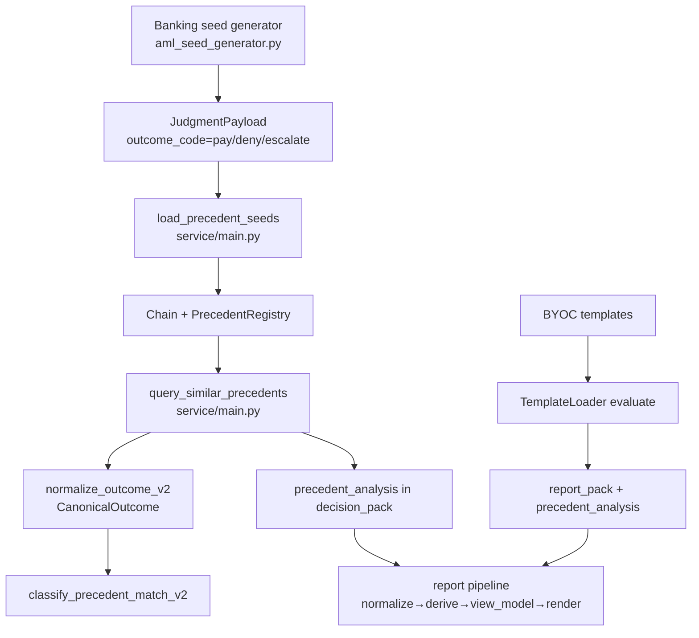

# DecisionGraph Banking Pipeline Audit

Scope: Banking/AML pipeline only. Focus on outcome codes, precedent matching, and report rendering. References use source line links.

## Summary (What I Found)
- Banking seeds are generated in code, not YAML. Seed outcomes use v1 insurance-style labels: `pay`, `deny`, `escalate`.
- The banking loader does not normalize outcomes; it persists those v1 labels directly into the precedent chain.
- Outcome normalization and classification use the v2 model (ALLOW/EDD/BLOCK + reporting) in service logic, but multiple v1 mappings remain in the pipeline and reports.
- Rendering has a single official pipeline, but legacy and bridge files still exist as parallel logic paths.

---

## STEP 1: SEED AUDIT

### 1.1 Seed locations
- Banking seeds: generated in code, no YAML/JSON seed files found in `decisiongraph-complete`.
  - Generator: [decisiongraph-complete/src/decisiongraph/aml_seed_generator.py](decisiongraph-complete/src/decisiongraph/aml_seed_generator.py#L1)
- Insurance seeds (separate product, contamination risk if accidentally loaded):
  - ClaimPilot YAML seeds live under `claimpilot/src/claimpilot/precedent/seeds/*.yaml` (not part of banking pipeline).

### 1.2 Unique `outcome_code` values (banking)
From seed scenarios in [decisiongraph-complete/src/decisiongraph/aml_seed_generator.py](decisiongraph-complete/src/decisiongraph/aml_seed_generator.py#L56-L110):
- `pay`
- `deny`
- `escalate`

These are persisted directly into the payload:
- [decisiongraph-complete/src/decisiongraph/aml_seed_generator.py](decisiongraph-complete/src/decisiongraph/aml_seed_generator.py#L494-L505)

### 1.3 Contamination flags (insurance vocabulary)
Expected banking terms: `FILE_STR`, `NO_REPORT`, `CLEARED`, `BLOCK`, `DECLINE`, `EDD_REQUIRED`.

Found in banking seeds (v1 terms):
- `pay`, `deny`, `escalate` (insurance-style). See [decisiongraph-complete/src/decisiongraph/aml_seed_generator.py](decisiongraph-complete/src/decisiongraph/aml_seed_generator.py#L56-L110).

No occurrences of `PAY`, `DENY`, `PARTIAL_PAY`, `CLAIM`, `CLAIMANT`, `ADJUSTER`, `POLICY` in banking seed files (because there are no banking seed YAML files).

---

## STEP 2: LOADER AUDIT

### 2.1 End-to-end loader path
- Banking loader: `load_precedent_seeds()` in service layer.
  - [decisiongraph-complete/service/main.py](decisiongraph-complete/service/main.py#L135-L208)
- It calls `generate_all_banking_seeds()` and writes each `JudgmentPayload` into a chain via `create_judgment_cell()`.
- No normalization or translation occurs in this path.

### 2.2 Does it call `normalize_outcome()` or translation?
- No. The loader stores the seed `outcome_code` exactly as produced by the generator.
- Evidence: no call to `normalize_outcome()` in [decisiongraph-complete/service/main.py](decisiongraph-complete/service/main.py#L135-L208).

### 2.3 What goes into storage vs YAML
- There is no YAML banking seed source. The stored values are exactly the generator values:
  - `outcome_code = scenario["outcome"]` where values are `pay`, `deny`, `escalate`.
  - [decisiongraph-complete/src/decisiongraph/aml_seed_generator.py](decisiongraph-complete/src/decisiongraph/aml_seed_generator.py#L494-L505)

---

## STEP 3: NORMALIZATION AUDIT

### 3.1 All normalization functions (banking pipeline)
- V2 canonicalization: `normalize_outcome_v2()`
  - [decisiongraph-complete/service/main.py](decisiongraph-complete/service/main.py#L1170-L1311)
- V1 wrapper: `normalize_outcome()`
  - [decisiongraph-complete/service/main.py](decisiongraph-complete/service/main.py#L1316-L1331)
- Label mapping: `map_aml_outcome_label_v2()`
  - [decisiongraph-complete/service/main.py](decisiongraph-complete/service/main.py#L1368-L1417)

### 3.2 Insurance vocabulary still used in core model
- `JudgmentPayload` validation limits outcomes to `pay|deny|partial|escalate`.
  - [decisiongraph-complete/src/decisiongraph/judgment.py](decisiongraph-complete/src/decisiongraph/judgment.py#L264-L275)

### 3.3 Explicit v1 mapping in decision path
- `service/main.py` maps engine verdicts to `pay/deny/escalate` before precedent scoring:
  - [decisiongraph-complete/service/main.py](decisiongraph-complete/service/main.py#L942-L955)

### 3.4 Translation table (input → intermediate → output)

| Stage | Input | Translation | Output | Location |
|---|---|---|---|---|
| Proposed outcome (engine verdict) | `pass`, `hard_stop`, `str`, `escalate` | outcome_map | `pay/deny/escalate` | [service/main.py](decisiongraph-complete/service/main.py#L942-L955) |
| v2 canonicalization | `pay/deny/escalate/approve/str/...` | `normalize_outcome_v2()` | `CanonicalOutcome(disposition, basis, reporting)` | [service/main.py](decisiongraph-complete/service/main.py#L1170-L1311) |
| v1 back-compat | `CanonicalOutcome` | `normalize_outcome()` | `pay/deny/escalate` | [service/main.py](decisiongraph-complete/service/main.py#L1316-L1331) |
| Report label mapping | `CanonicalOutcome` | `map_aml_outcome_label_v2()` | `STR REQUIRED`, `NO REPORT`, etc. | [service/main.py](decisiongraph-complete/service/main.py#L1368-L1417) |

Contamination points in this table are the `pay/deny/escalate` stages.

---

## STEP 4: CLASSIFICATION AUDIT

### 4.1 Classification functions and callers
- `classify_precedent_match_v2()` uses v2 canonical outcomes (ALLOW/EDD/BLOCK).
  - [decisiongraph-complete/service/main.py](decisiongraph-complete/service/main.py#L1334-L1391)
- Wrapper `classify_precedent_match()` normalizes raw outcomes to v2 before comparing.
  - [decisiongraph-complete/service/main.py](decisiongraph-complete/service/main.py#L1657-L1673)
- Query pipeline uses v2 canonicalization for precedent outcomes.
  - [decisiongraph-complete/service/main.py](decisiongraph-complete/service/main.py#L1715-L1729)

### 4.2 Does it compare normalized or native outcomes?
- It compares normalized v2 dispositions and basis, not raw `pay/deny`.
- However, the raw `pay/deny/escalate` values still enter as inputs to normalization.

---

## STEP 5: RENDERING AUDIT

### 5.1 Rendering paths (API)
- **Official pipeline**: normalize → derive → view_model → render
  - [decisiongraph-complete/service/routers/report/pipeline.py](decisiongraph-complete/service/routers/report/pipeline.py#L1-L46)
- **API router** uses pipeline for HTML/JSON/Markdown
  - [decisiongraph-complete/service/routers/report/router.py](decisiongraph-complete/service/routers/report/router.py#L1-L105)
- HTML template: `decision_report.html` under service/templates (Jinja2).

### 5.2 Rendering paths (standalone / CLI)
- Scripts that explicitly call `compile_report()`:
  - [decisiongraph-complete/run_structuring_case.py](decisiongraph-complete/run_structuring_case.py#L28-L186)
  - [decisiongraph-complete/run_pep_pain_case.py](decisiongraph-complete/run_pep_pain_case.py#L24-L176)
  - [decisiongraph-complete/run_layering_case.py](decisiongraph-complete/run_layering_case.py#L24-L179)
- Validation report builder uses pipeline:
  - [decisiongraph-complete/generate_validation_reports.py](decisiongraph-complete/generate_validation_reports.py#L25-L131)

### 5.3 Parallel / legacy renderers (separate logic)
- `report_legacy.py` has its own rendering and report cache logic.
  - [decisiongraph-complete/service/routers/report_legacy.py](decisiongraph-complete/service/routers/report_legacy.py#L1-L120)
- `report_bridge.py` implements its own decision_pack conversion and render flow.
  - [decisiongraph-complete/report_bridge.py](decisiongraph-complete/report_bridge.py#L1-L190)

These are separate paths that can diverge from the official pipeline if wired or executed.

### 5.4 Which path the demo uses
- The web demo uses `/templates/evaluate` and then `/report/{id}` which routes through the official pipeline:
  - [decisiongraph-complete/service/routers/templates.py](decisiongraph-complete/service/routers/templates.py#L60-L105)
  - [decisiongraph-complete/service/routers/report/router.py](decisiongraph-complete/service/routers/report/router.py#L1-L105)

---

## Contamination Points (Insurance Vocabulary)

**High risk (runtime impact)**
- Seed outcomes are `pay/deny/escalate` instead of banking-native labels.
  - [decisiongraph-complete/src/decisiongraph/aml_seed_generator.py](decisiongraph-complete/src/decisiongraph/aml_seed_generator.py#L56-L110)
- Loader persists these values without normalization.
  - [decisiongraph-complete/service/main.py](decisiongraph-complete/service/main.py#L135-L208)
- Proposed outcomes are mapped to `pay/deny/escalate` before precedent scoring.
  - [decisiongraph-complete/service/main.py](decisiongraph-complete/service/main.py#L942-L955)
- `JudgmentPayload` validation permits only `pay/deny/partial/escalate`.
  - [decisiongraph-complete/src/decisiongraph/judgment.py](decisiongraph-complete/src/decisiongraph/judgment.py#L264-L275)

**Medium risk (analysis / reporting)**
- Precedent check report logic counts `pay/deny/partial/escalate` outcomes.
  - [decisiongraph-complete/src/decisiongraph/precedent_check_report.py](decisiongraph-complete/src/decisiongraph/precedent_check_report.py#L590-L614)

**Low risk (tests / docs)**
- Test fixtures still use claims namespaces and insurance schema IDs.
  - [decisiongraph-complete/tests/test_precedent_registry.py](decisiongraph-complete/tests/test_precedent_registry.py#L39-L170)

---

## Dependency Graph (Data Flow)

---

## Recommended Fix Order

1. **Replace v1 outcome_code in banking seeds** with canonical v2 fields only (or add banking-native labels alongside v1 for backward compat). Update [decisiongraph-complete/src/decisiongraph/aml_seed_generator.py](decisiongraph-complete/src/decisiongraph/aml_seed_generator.py#L56-L110).
2. **Update `JudgmentPayload` validation** to allow banking-native outcomes or to accept a v2-only outcome mode (no v1 `pay/deny/partial/escalate`). See [decisiongraph-complete/src/decisiongraph/judgment.py](decisiongraph-complete/src/decisiongraph/judgment.py#L264-L275).
3. **Remove/replace `outcome_map` to v1 labels** in [decisiongraph-complete/service/main.py](decisiongraph-complete/service/main.py#L942-L955). Use canonical v2 disposition/reporting for precedent scoring.
4. **Update precedent analysis helpers** (e.g., precedent_check_report) to operate on v2 canonical outcomes instead of `pay/deny/partial/escalate`. See [decisiongraph-complete/src/decisiongraph/precedent_check_report.py](decisiongraph-complete/src/decisiongraph/precedent_check_report.py#L590-L614).
5. **Retire or clearly isolate legacy renderers** (`report_legacy.py`, `report_bridge.py`) to avoid divergent business logic.

---

## Notes / Open Questions
- No banking seed YAML/JSON files exist in the repo; banking seeds are generated in code. If you expect YAML seeds, they are missing from the runtime pipeline.
- If ClaimPilot insurance seeds are ever loaded into the banking chain, contamination will be severe. Current banking loader does not reference ClaimPilot seeds.
